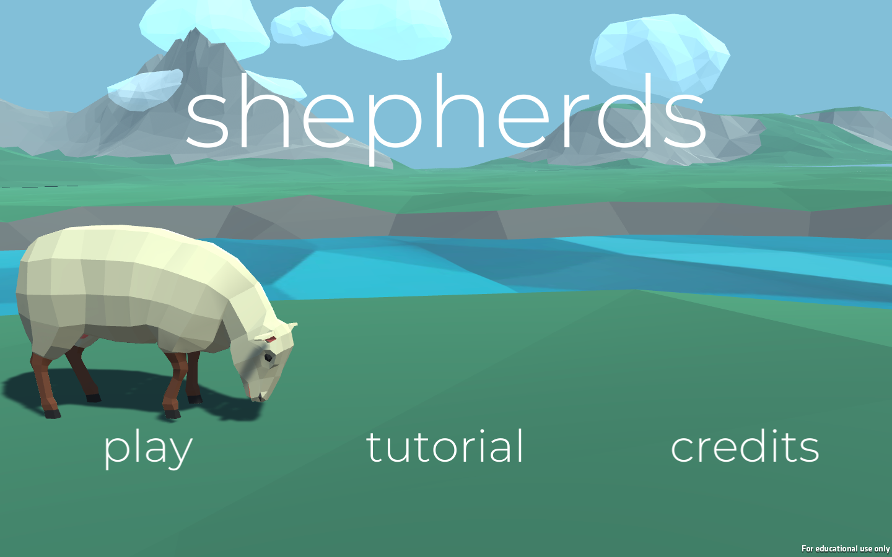
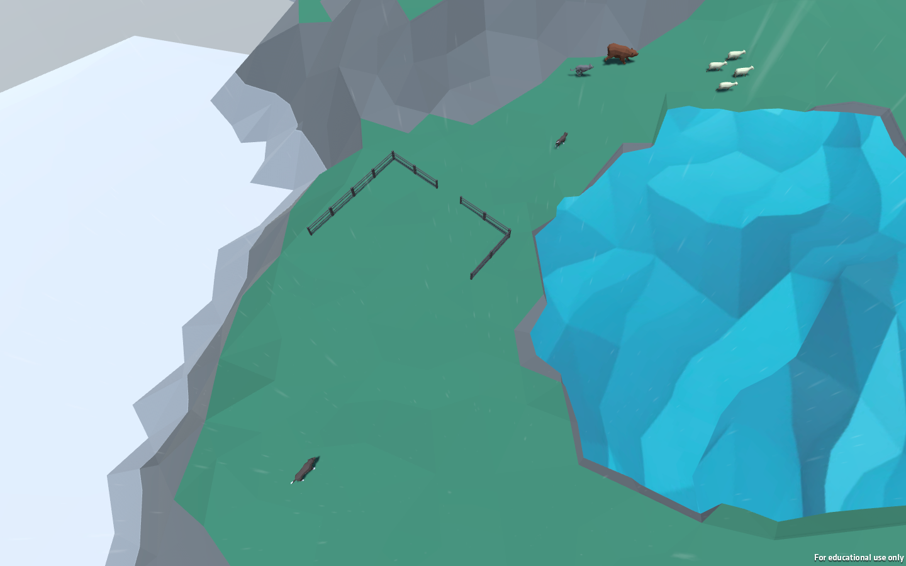

# shepherds
shepherds is a local co-op game set in the Scottish Highlands. In this life game, the players are sheepherding dogs who have to herd a flock of sheep over a vast landscape and guide them back to the barn, protecting them from various obstacles and enemies along the way. The full game can be downloaded at: https://stanfordstudentgames.itch.io/shepherds. 

**Moodboard**

**One-Page Game Design**

**Gameplay**

**Credits**

